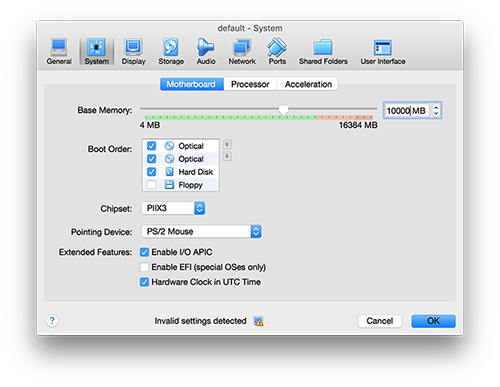

MSGF++ is an open source pipelines for Mass Spectrometry Data Pre-Processing and Quantification, wrapped in a Docker container. Identification is performed by utilizing [MSGF+ tool developed by PNNL](https://omics.pnl.gov/software/ms-gf), and Quantification is conducted by utilizing [MSnbase](http://bioconductor.org/packages/release/bioc/html/MSnbase.html), a bioconductor package by Laurent Gatto _et. all._

MSGF++ uses [Bioconductor Proteomics](https://github.com/Bioconductor/bioc_docker) image as the base image.

This image provides a simple container for running MS-GF+.

### Requirements
To run MSGF++, Docker engine must be installed. [Click here](https://docs.docker.com/engine/installation/) for a detailed information to install Docker engine on various operating system including Windows and MacOS.

Protein identification and quantification is a computationally intensive process. Depending on the size of the data, at least 8Gb available memory on the Docker Machine is required. Click here for more information on increasing the memory allocation for Docker engine on VirtualBox machine for MacOS and Windows Users.

### Operation
MS-GF+ can be run from this image by accessing its .jar file in the /root folder. i.e. "/root/MSGFPlus.jar".

Execution is the same as running the program from the command line. i.e. "java -jar /root/MSGFPlus.jar -s /root/spectrum.mzml -o output_file.mzid"

For more information on running MS-GF+, refer to the PNNL documentation. [Click here](https://msgfplus.github.io/msgfplus/)

### Contact Information

You are invited to contribute for new features, updates, fixes by sending pull requests.
